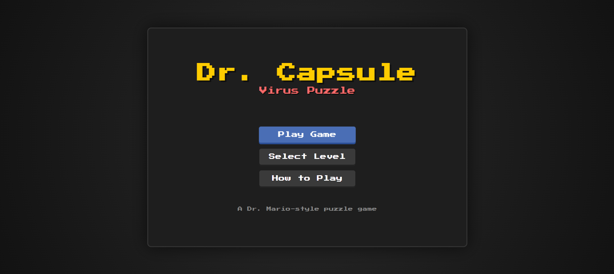

<div align="center">

# 💊 Dr. Capsule - Virus Puzzle Game 🦠


**🎮 [PLAY THE GAME HERE](https://ferdyatmaja.github.io/Dr-Capsule---Pill-Puzzle-Game/) 🎮**

*A classic Dr. Mario-style puzzle game that will test your strategic thinking and reflexes!*



</div>

---

## 🎮 Game Overview

> **"Can you cure all the viruses and become the ultimate Dr. Capsule?"**

Dr. Capsule is an addictive falling-block puzzle game where strategy meets speed! Drop colorful capsules to eliminate dangerous viruses by creating matches of 4 or more blocks. With **20 progressively challenging levels**, each stage will test your puzzle-solving skills to the limit!

### 🌟 What Makes It Special?
- 🧩 **Brain-teasing puzzle mechanics** that are easy to learn, hard to master
- 🎯 **Strategic gameplay** requiring planning and quick thinking
- 🔥 **Addictive chain reactions** for massive score multipliers
- 🎨 **Nostalgic retro aesthetics** with modern smooth gameplay

## ✨ Key Features

<table>
<tr>
<td width="50%">

### 🎯 **Gameplay**
- 🏆 **20 Challenging Levels** with increasing difficulty
- 🧩 **Classic Puzzle Mechanics** - Drop, rotate, match!
- ⚡ **Chain Reactions** for explosive combos
- 🎮 **Intuitive Controls** for smooth gameplay
- ⏸️ **Pause/Resume** anytime

</td>
<td width="50%">

### 🎨 **Experience**
- 🕹️ **Retro Pixel Art Style** with modern polish
- 🎵 **Audio Support** for immersive experience
- 📊 **Advanced Scoring System** with bonuses
- 🎪 **Level Selection** - replay your favorites
- 📱 **Browser Compatible** - play anywhere!

</td>
</tr>
</table>

## 🎯 How to Play

<div align="center">

### 🎪 **Mission: Eliminate All Viruses!**
*Match 4+ blocks of the same color horizontally or vertically*

</div>

### 🎮 Controls

<table>
<tr>
<td align="center"><kbd>←</kbd> <kbd>→</kbd></td>
<td><strong>Move capsule left/right</strong></td>
</tr>
<tr>
<td align="center"><kbd>↑</kbd></td>
<td><strong>Rotate capsule</strong></td>
</tr>
<tr>
<td align="center"><kbd>↓</kbd></td>
<td><strong>Fast drop</strong></td>
</tr>
<tr>
<td align="center"><kbd>Space</kbd></td>
<td><strong>Hard drop (instant)</strong></td>
</tr>
<tr>
<td align="center"><kbd>P</kbd></td>
<td><strong>Pause game</strong></td>
</tr>
<tr>
<td align="center"><kbd>ESC</kbd></td>
<td><strong>Pause/Resume</strong></td>
</tr>
</table>

### 💡 Pro Tips

> 🔥 **Master these strategies to dominate the leaderboard!**

- 🎯 **Chain Reactions**: Set up multiple matches for massive point bonuses
- 👀 **Watch the Pieces**: Capsule halves fall after matches - use them wisely!
- 📈 **Level Up**: Each level adds more viruses - plan your strategy
- 🧠 **Think Ahead**: Plan 2-3 moves in advance for maximum efficiency

## 🚀 Quick Start

<div align="center">

### 🎮 **[CLICK HERE TO PLAY NOW!](https://ferdyatmaja.github.io/Dr-Capsule---Pill-Puzzle-Game/)** 🎮

*No downloads, no installation - just pure puzzle fun!*

</div>

### 💻 Local Setup

**Prerequisites:** Any modern web browser 🌐

```bash
# Clone the repository
git clone [https://github.com/FerdyAtmaja/Dr-Capsule---Pill-Puzzle-Game]

# Navigate to game directory
cd "Dr Capsule - Pill Puzzle Game"

# Open in browser
open index.html
```

**That's it! Start eliminating viruses! 🦠💊**

### File Structure
```
Dr Capsule - Pill Puzzle Game/
├── index.html          # Main game file
├── style.css           # Game styling
├── js/                 # JavaScript modules
│   ├── main.js         # Game initialization
│   ├── game.js         # Core game logic
│   ├── grid.js         # Game board management
│   ├── capsule.js      # Capsule mechanics
│   ├── virus.js        # Virus management
│   ├── levels.js       # Level configuration
│   ├── ui.js           # User interface
│   ├── audio.js        # Audio management
│   └── constants.js    # Game constants
└── assets/             # Game assets
    ├── images/         # Sprite images
    └── sounds/         # Audio files
```

## 🎵 Audio

The game includes placeholder audio support. Audio files can be added to the `assets/sounds/` directory:
- `move.mp3` - Capsule movement sound
- `rotate.mp3` - Capsule rotation sound
- `drop.mp3` - Capsule drop sound
- `match.mp3` - Block match sound
- `clear-virus.mp3` - Virus elimination sound
- `level-complete.mp3` - Level completion sound
- `game-over.mp3` - Game over sound

## 🏆 Scoring System

<div align="center">

### 💰 **Point Values**

</div>

| Action | Points | Description |
|--------|--------|-------------|
| 🧩 **Block Match** | 100 pts | Per matched block |
| 🦠 **Virus Elimination** | 400 pts | Bonus per virus cleared |
| 🔥 **Combo Chain** | 200 pts | Per combo level |
| 🎯 **Level Complete** | 1000 pts | Completion bonus |

> 💡 **Pro Tip**: Chain reactions can multiply your score exponentially!

## 🛠️ Technical Details

- **Grid Size**: 8×16 cells
- **Languages**: HTML5, CSS3, JavaScript (ES6+)
- **Architecture**: Modular JavaScript classes
- **Compatibility**: Modern browsers with ES6 support
- **No Dependencies**: Pure vanilla JavaScript implementation
- **AI Assistant**: Built with help from Amazon Q Developer

## 🤖 Development Story

<div align="center">

### 🚀 **Built with Amazon Q Developer**

*This game was developed with the assistance of Amazon Q, AWS's AI-powered coding assistant*

</div>

Amazon Q Developer helped accelerate the development process by:
- 🧩 **Code Generation**: Assisted in writing modular JavaScript classes
- 🐛 **Debugging**: Helped identify and fix game logic issues
- 🎨 **Architecture**: Provided guidance on clean code structure
- ⚡ **Optimization**: Suggested performance improvements
- 📚 **Documentation**: Helped create comprehensive code comments

> 💡 **Want to learn how this game was built?** Check out the detailed development article below!

## 🎨 Customization

The game can be easily customized by modifying:
- `constants.js` - Game parameters and difficulty settings
- `style.css` - Visual appearance and colors
- `levels.js` - Level configurations and virus patterns

## 📚 Articles & Resources

<div align="center">

### 📖 **Learn How This Game Was Built**

[](YOUR_ARTICLE_LINK_HERE)

</div>

## 🐛 Known Issues

- Audio files are currently disabled (commented out in HTML)
- Game requires manual audio file setup for sound effects

---

<div align="center">

**Created by [Ferdy Atmaja](https://github.com/FerdyAtmaja)**

*Built with the power of Amazon Q Developer* 🤖

[](https://github.com/FerdyAtmaja)
[](https://www.linkedin.com/in/ferdy-atmaja)

</div>

---

<div align="center">

### 🎉 **Ready to cure some viruses?** 🎉

**[START PLAYING NOW!](https://ferdyatmaja.github.io/Dr-Capsule---Pill-Puzzle-Game/)** 💊🦠

*Don't forget to ⭐ star this repo if you enjoyed the game!*

</div>